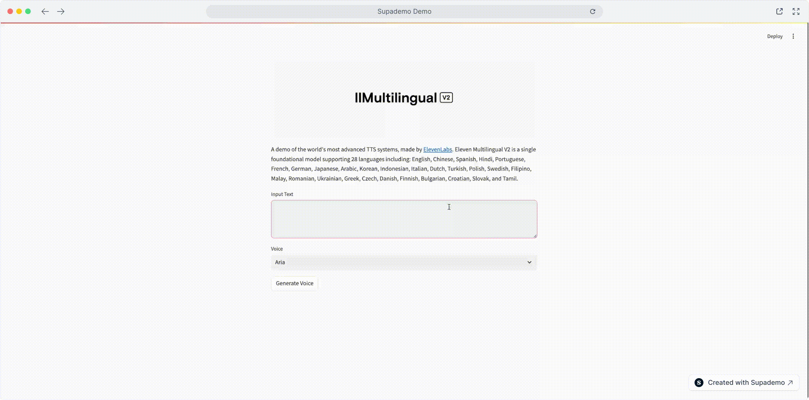

# ElevenLabs TTS Streamlit App

A Streamlit-based web application that for ElevenLabs' text-to-speech capabilities, supporting 28 languages through the Eleven Multilingual V2 model.



## Features

- Text-to-speech conversion using ElevenLabs API
- Multiple voice options (Based on your Voice Library)
- Support for 28 languages
- Audio playback
- Download generated audio files
- Docker support for easy deployment

## Supported Languages

English, Chinese, Spanish, Hindi, Portuguese, French, German, Japanese, Arabic, Korean, Indonesian, Italian, Dutch, Turkish, Polish, Swedish, Filipino, Malay, Romanian, Ukrainian, Greek, Czech, Danish, Finnish, Bulgarian, Croatian, Slovak, and Tamil.

## Prerequisites

- Docker and Docker Compose
- ElevenLabs API key

## Setup

1. Clone the repository:
    ```bash
    git clone <repository-url>
    cd elevenlabs-tts-demo
    ```

2. Create a `.env` file in the project root and add your ElevenLabs API key:
    ```bash
    ELEVEN_API_KEY=your_api_key_here
    ```

3. Build and run the Docker container:
    ```bash
    docker-compose build
    docker-compose up
    ```

4. Open your browser and navigate to:
    ```
    http://localhost:8501
    ```

## Local Development

If you prefer to run the application locally without Docker:

1. Install the required packages:
    ```bash
    pip install -r requirements.txt
    ```

2. Run the Streamlit application:
    ```bash
    streamlit run app.py
    ```

## Usage

1. Enter your text in the input field
2. Select a voice from the dropdown menu
3. Click "Generate Voice" to create the audio
4. Use the audio player to listen to the generated speech
5. Download the audio file using the "Download Audio" button

## License

This project is licensed under the MIT License - see the [LICENSE](LICENSE) file for details.

## Acknowledgments

- [ElevenLabs](https://elevenlabs.io) for providing the TTS API
- [Streamlit](https://streamlit.io) for the web application framework
